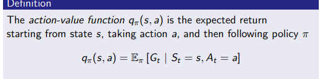
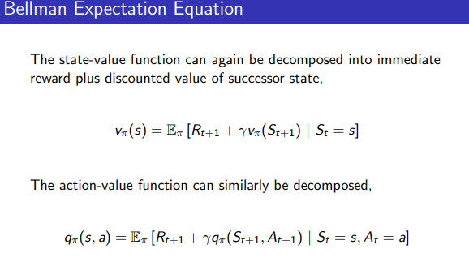
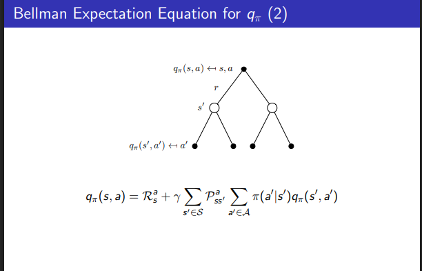
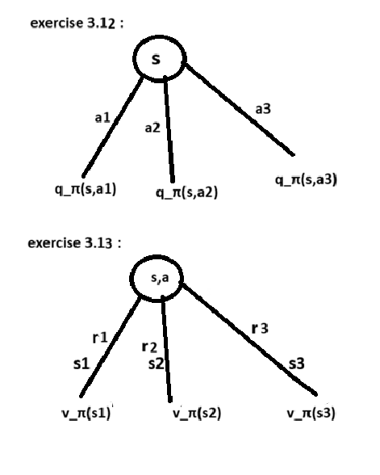

exercise 3.1 :
    1.Google news feed(or movie recommendation system):
        agent : news recommendation system
        environment : user + current top news or available articles
        states : viewed history , liked articles or movies ,diabled articles
        actions : recommend a news or movie , show available articles
        rewards : +5 if user clicks the article or opens the movie ,
                  +10 if user clicks the article or movie and click the like button  ,
                  -10 if user closes without choosing anyone of them ,
                  -20 if user disables recommendations
        It is partially observable MDP because we don’t know user’s true interests and only see clicks.Since user preferences change, environment is non-stationary and rewards can be delayed.

    2.Maze navigation game : 
        agent : maze-solving cat(let say)
        environment : walls, free paths, start position, exit
        states : grid cell coordinates
        actions :  move up , move down , move left , move right
        rewards : +100 if agent reaches the exit, 
                  −1 for each step taken
                  −5 if agent hits a wall
        It is fully observable MDP because agent can observe its environment fully.Since environment doesnot change, it is stationary and rewards are immediate.
    
    3.Uber driver rating :
        agent : driver
        environment : passengers, trip conditions, traffic
        states : rating history, location, trip details
        actions : behavior(politeness), driving(smoothness, speed)
        rewards : +5 if the passenger gives high rating (4–5 stars)
                  +10 if the passenger leaves positive feedback or tip
                  −10 if the passenger gives low rating (1–2 stars)
                  −20 if repeated poor ratings
        It is partially observable MDP because agent cannot observe its passengers preferences or opinions.Since passenger preferences are situation dependent, environment is non-stationary and rewards can be delayed.

exercise 3.2 :
    No, reinforcement learning framework is not adequate for all goal-directed learning tasks.RL works well when the task involves sequential decision making(generally by dynamic programming), when actions influence future states,when rewarded for the actions by learning interaction with the environment.The exceptions are when it is pure supervised learning(mail spam detection by labelled sets),
    one-shot puzzle solving(not like maze navigation but like addition of two numbers), when rewards cannot be measured (subjective oriented solutions,creativity in designing).

exercise 3.5 :
    The reward designing is bad.The agent receives zero reward for all actions except for escaping.Most episodes end without escaping.Therefore, almost all action sequences look equally good (return = 0).The agent gets no informative feedback about which actions are better.Hence no improvement for an action is seen.The reward function does not distinguish good and bad wandering, shorter paths vs longer paths.Hence the goal is effectively not communicated.This can be fixed by adding negative reward or penalty for each step.

exercise 3.8 :
    
    we know that action value function q_π​(s,a)=E_π​[G_t​ ∣ S_t​=s,A_t​=a] and the return is G_t​=R_(t+1)​+γG_(t+1)​
    hence q_π​(s,a)=E_π​[R_(t+1)​+γG_(t+1)​ ∣ S_t​=s,A_t​=a]
    since after reaching S_(t+1) the next state A_(t+1),the next action is chosen according to policy π : G_(t+1)​=q_π​(S_(t+1)​,A_(t+1)​)
    hence q_π​(s,a)=E_π​[R_(t+1)​+γq_π​(S_(t+1)​,A_(t+1)​) ∣ S_t​=s,A_t​=a] 
    
    in general notation q_π​(s,a)=∑_(r,s')p(s′,r∣ s,a)[r+γ∑_(a')π(a′∣ s′)q_π​(s′,a′)]
    

exercise 3.12 :
    we know that state value function v_π​(s)=E_π​[q_π​(s,A_t)​ ∣ S_t​=s]
    v_π​(s)=∑π(a∣ s)q_π​(s,a) for actions a.

exercise 3.13 :
    we know that q_π​(s,a)=E_π​[R_(t+1)​+γv_π​(S_(t+1)​​) ∣ S_t​=s,A_t​=a] 
    in general notation q_π​(s,a)=∑_(r,s')p(s′,r∣ s,a)[r+γv_π​(s')]
